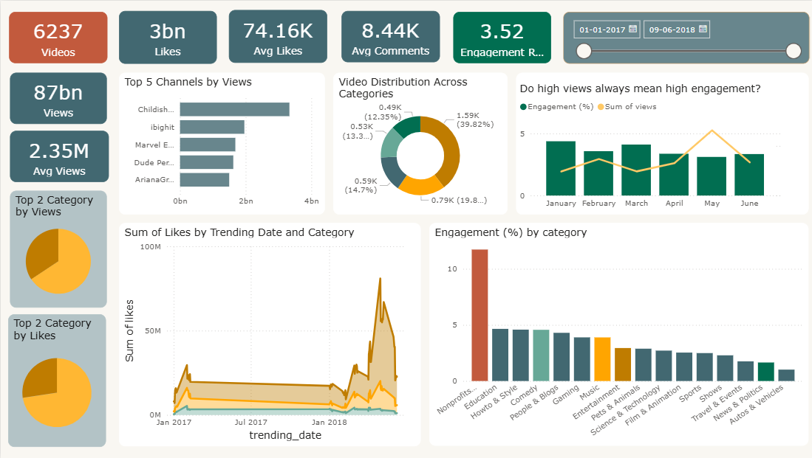

# YouTube Analytics Dashboard

A compact, interactive analytics dashboard that highlights total videos, cumulative views and likes, average views/likes/comments, engagement rate, top channels by views, category distribution, and time-based trends to reveal what drives audience engagement.

## Features

- KPIs: total videos, total views, total likes, average views, average likes, average comments, and overall engagement rate.
- Visuals: top channels by views, category distribution donut, monthly views vs. engagement, likes over time by category, and engagement percentage by category.
- Slicer: date-range control for zooming into specific periods and seasonality.

## Screenshot

## Use cases

- Track performance spikes, identify top-performing channels/categories, and monitor engagement changes month to month.
- Support content planning by comparing categories and seasons to find repeatable patterns.

## Data

- Source: https://www.kaggle.com/datasets/datasnaek/youtube-new

